# Baroclinic Storm Severity Regimes in a Perturbed-Physics OpenIFS Ensemble

**A data-driven analysis of how background atmospheric conditions shape extratropical cyclone severity**

This repository analyzes a large ensemble of OpenIFS (Open Integrated Forecasting System) idealised baroclinic-wave simulations. Each ensemble member was initialised with a different combination of seven background atmospheric parameters — jet strength, jet height/shape, static stability, initial humidity, lapse rate, sea-surface roughness (Charnock parameter), and a categorical zonal-wavenumber parameter — and run forward to let baroclinic instability grow, mature, and (where it succeeds) spin up an extratropical storm. Every storm that formed was tracked, and each track was summarised by a set of severity metrics: peak relative vorticity, minimum sea-level pressure, peak 10 m wind speed, vorticity deepening rate, a Storm Severity Index (SSI), and windstorm footprint metrics at two wind-speed thresholds.

Here's a quick look at what falls out of this analysis before diving into the details: every storm plotted in full 3D principal-component space (see [§16](#16-severity-regimes-in-full-3d-pca-space) for the write-up), colored by severity regime, rotating so you can see how cleanly the five regimes — `null`, `weak`, `moderate`, `severe`, `anomalous_footprint` — separate along a single dominant axis of increasing storm severity.

<p align="center">
  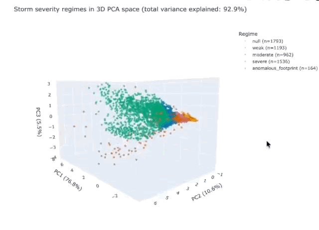
</p>

*(For a version you can rotate and explore yourself rather than just watch, see the [interactive HTML plot in §16](figures/19_severity_regimes_3d_pca_interactive.html).)*

The analysis asks three linked questions of that dataset:

1. **Structure** — Do the storms produced by this ensemble fall into a small number of natural *severity regimes*, or does severity vary continuously?
2. **Predictability** — How much of a storm's eventual severity is already determined by the background atmospheric state it grew out of, versus the storm's own chaotic evolution?
3. **Attribution** — Which background parameters, if any, distinguish the most severe or most anomalous storms from the rest?

The workflow moves from raw XML/CSV ingestion, through exploratory data analysis, principal component analysis (PCA), Gaussian-mixture clustering, a small classification network, and finally two feedforward regression networks — a single model and a 5-member deep ensemble — used to quantify both predictive accuracy and predictive uncertainty.

---

## Repository contents

```
baroclinic-storm-severity-regimes/
├── README.md                                     <- this file
├── LICENSE
├── requirements.txt
├── notebooks/
│   └── baroclinic_storm_severity_regimes.ipynb   <- full analysis, run top-to-bottom
└── figures/                                      <- every figure produced by the notebook
    ├── 01_storms_per_run.png ... 18_anomalous_footprint_distributions.png
    └── 16_severity_regimes_3d_interactive.html, 19_severity_regimes_3d_pca_interactive.html
```

The notebook writes every figure below to `figures/` automatically as it runs (see [Reproducing this analysis](#reproducing-this-analysis)).

## Data

Source: Bouvier et al. 2025, *Scientific Data* (OpenIFS@home / CPDN). Full ensemble of 6,500 idealised moist baroclinic-wave simulations (6,388 successful), run with OpenIFS cycle 43R3v2 at T<sub>L</sub>159 (~125 km grid, 91 sigma levels), 3-hourly output over a 20-day forecast.

- **Background parameters** — `openifs_submission.xml`: one `<workunit>` element per ensemble member, storing the 7 perturbed background parameters (`n`, `b`, `u0`, `Tv0`, `RH0`, `lapse_rate`, `charnock`). `unique_member_id` (a000–a50j) is the join key to the feature CSVs — not `ensemble_member_number`. Note `RH0` is stored as a fraction (0–0.8) in the XML even though the paper's Table 1 reports it in % (0–80).
- **Storm-tracked features** — `ExtractedFeatures/*.csv`: 22,259 files (~39.3 MB total). One `{unique_member_id}_general.csv` per successful run (background-only features, independent of storm formation), plus up to three `{unique_member_id}_{0,1,2}.csv` files — one row per tracked cyclone (TRACK keeps the first 3 per run). 89 features total across four categories: background-related, track-related, dynamical intensity, and impact-relevant intensity. The current notebook uses seven of these as regression targets: `MaxVo`, `MinMSLP`, `Vort deepening`, `MaxWS10`, `SSI at MaxVo`, `WFP at MaxVo at 15.0`, `WFP at MaxVo at 20.0`.
- **Join logic** — one run maps to zero–three storm rows, so a tidy ML table is keyed by `(unique_member_id, track_index)`, not by run alone. Train/test splits must be done at the `unique_member_id` (run) level: storms from the same run share background parameters, so row-level splitting leaks information between train and test.
- **Raw model output** (`batch_1018/`, not used by this notebook) — 6,388 run folders of GRIB fields, 28 physical variables at 19 pressure levels plus surface, ~10.34 TB total. Not included in this repository; see `.gitignore`.

> Data files are not included in this repository. Point `XML_PATH` and `FEATURES_DIR` at the top of the notebook to your local copies before running.

---

## Analysis walkthrough

### 1–4. Data loading, tidying, and validation

Background parameters (XML) and per-storm tracked features (CSV) are parsed separately, merged on `unique_member_id`, and passed through a set of sanity checks (parameter ranges, track-index cardinality, no more than 3 storms per run). Not every ensemble member produced a trackable storm — some background states are too stable for baroclinic instability to spin up a coherent storm within the simulation window.

<p align="center">
  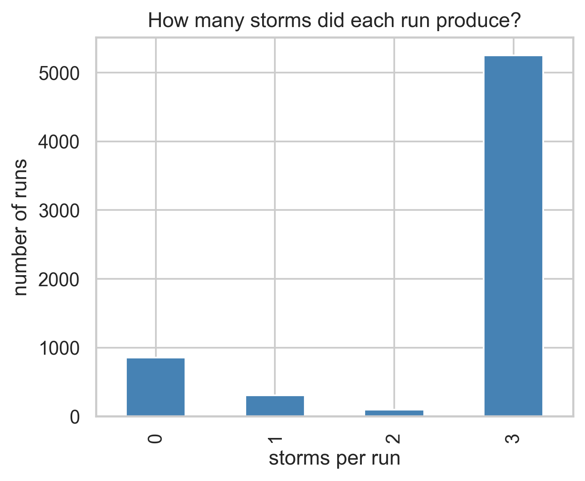
</p>

### 5. Exploratory data analysis

**Target variable distributions.** Several severity targets (SSI, both windstorm-footprint metrics) are heavily right-skewed with a large mass at or near zero — this shapes the log-transform and modelling choices made later.

<p align="center">
  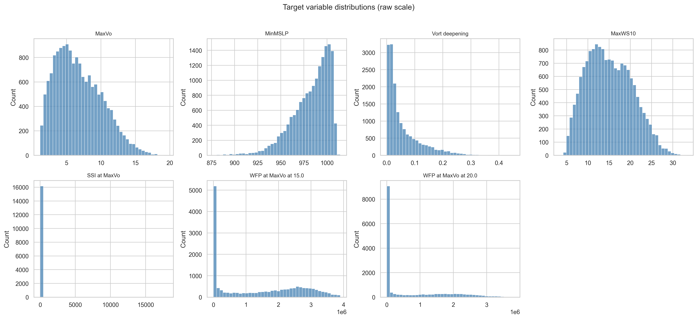
</p>

**Background parameter distributions.** The 7 perturbed parameters as actually sampled across the ensemble.

<p align="center">
  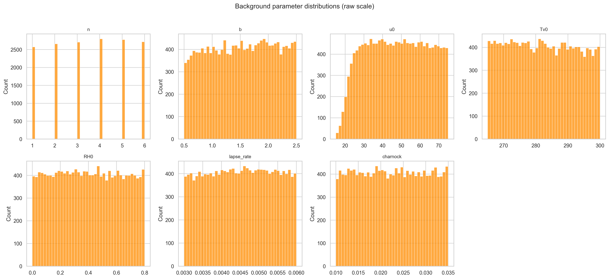
</p>

**Linear correlations between background parameters and targets.** A first, purely linear screen of which parameters associate with which outcomes — `u0` (zonal wind) and `b` (jet height) stand out; `Tv0`, `RH0`, and `charnock` show almost no linear signal.

<p align="center">
  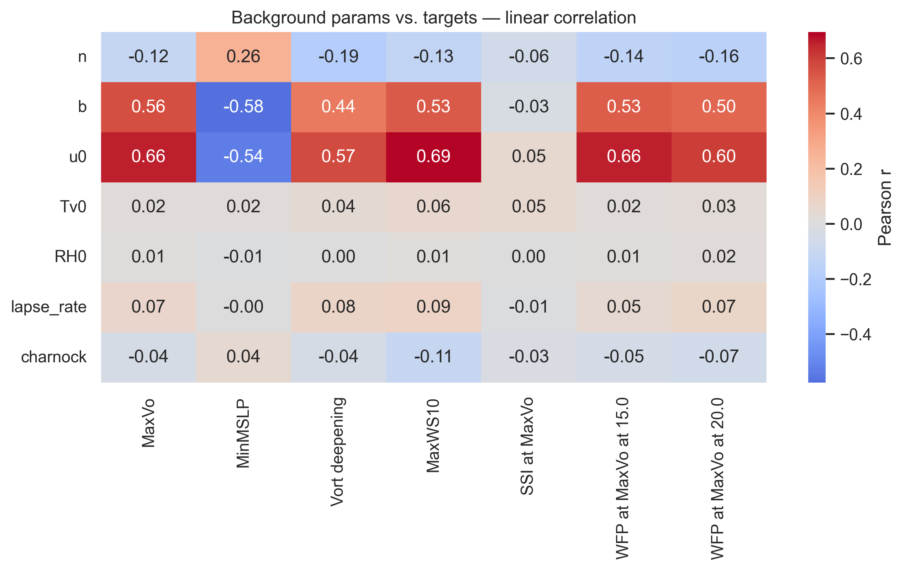
</p>

**Pairwise relationships between key targets.** A sample of 3,000 storms showing how peak vorticity, peak wind speed, minimum MSLP, and SSI relate to one another — an early hint of the two-dimensional structure (core intensity vs. impact/footprint) that PCA and clustering make precise below.

<p align="center">
  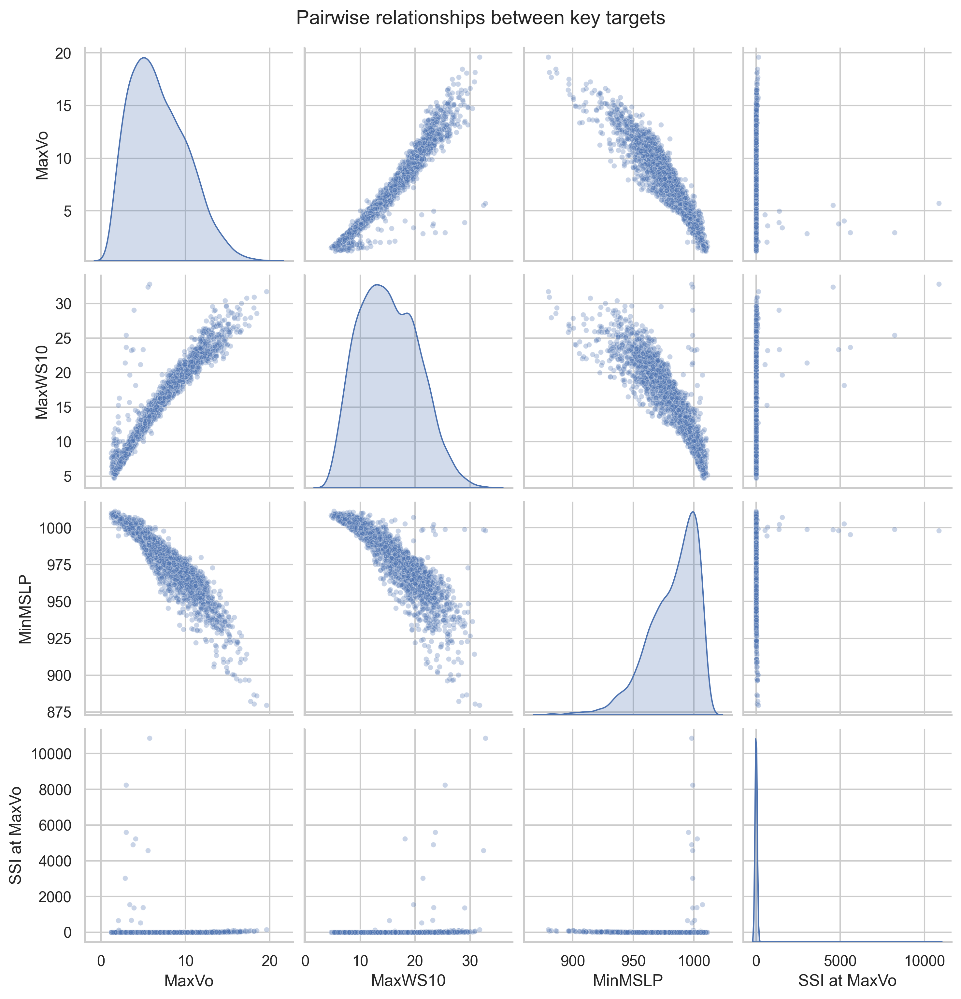
</p>

### 6–7. Deduplication and dimensionality reduction

One storm is selected per ensemble member (the highest-SSI storm), then the 7 severity targets (log-transformed where skewed, then standardized) are reduced with PCA.

**Explained variance and loadings.** PC1 alone explains 76.8% of variance and loads heavily on core-intensity metrics (MaxVo, MinMSLP, MaxWS10, Vort deepening); PC2 is dominated by SSI/WFP.

<p align="center">
  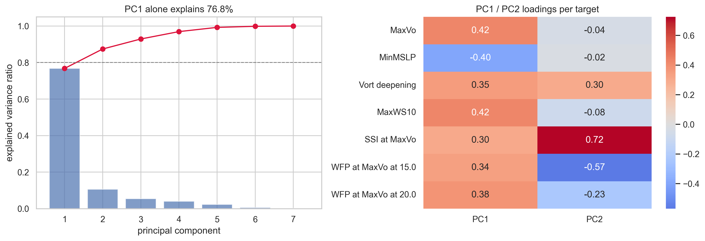
</p>

**PC1/PC2 scatter, colored by SSI and by MaxVo.** Confirms PC1 tracks core intensity and PC2 tracks the impact/footprint dimension.

<p align="center">
  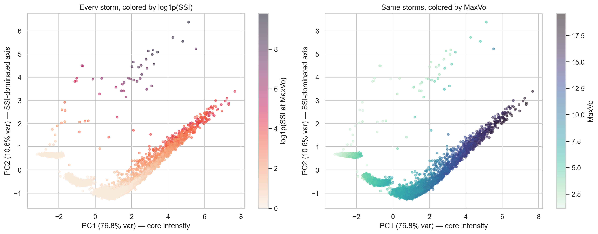
</p>

### 8. Clustering storms into severity regimes

**Model selection.** BIC/AIC (GMM) and inertia (KMeans) across candidate cluster counts.

<p align="center">
  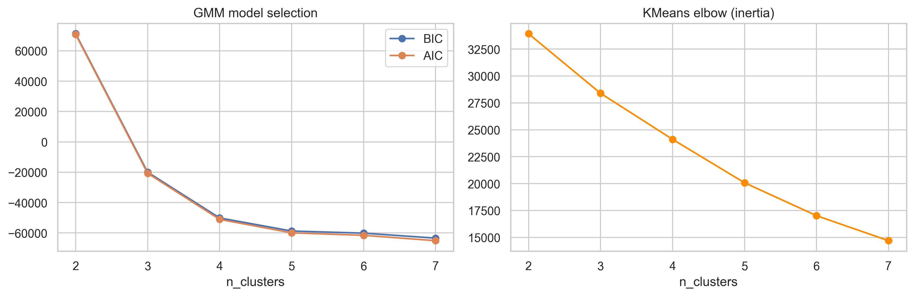
</p>

**KMeans (k=7) vs. GMM (k=5).** Both methods are fit on the full 7-dimensional standardized target space (not the 2D PCA projection) and agree closely.

<p align="center">
  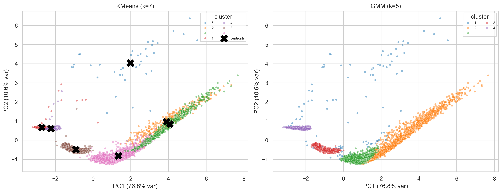
</p>

**Final GMM clustering (k=5).** The five Gaussian components separate cleanly along PC1/PC2 even though clustering never saw that 2D plane — a sign the two dominant PCA directions align with the same structure the full 7D fit found.

<p align="center">
  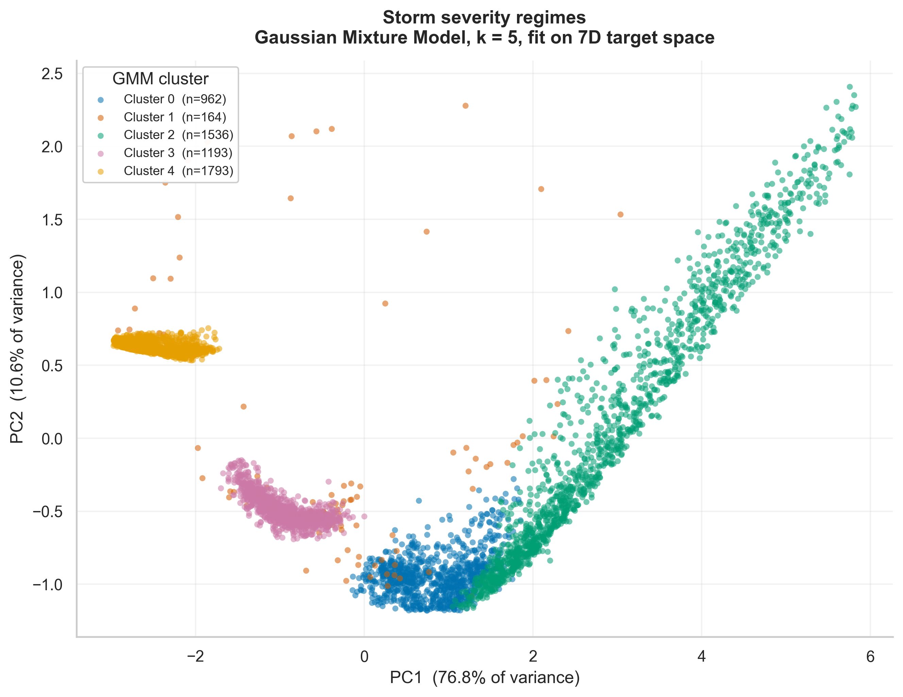
</p>

> **Note on reading this plot:** the (x, y) position of each point comes from PCA (2D, for display only); the color comes from the GMM fit on the full 7D target space. They are two independent calculations laid on top of one another.

### 9–11. Naming and visualizing the regimes

Clusters are ranked by mean SSI and mapped to human-readable labels: `null`, `weak`, `moderate`, `severe`, `anomalous_footprint`.

<p align="center">
  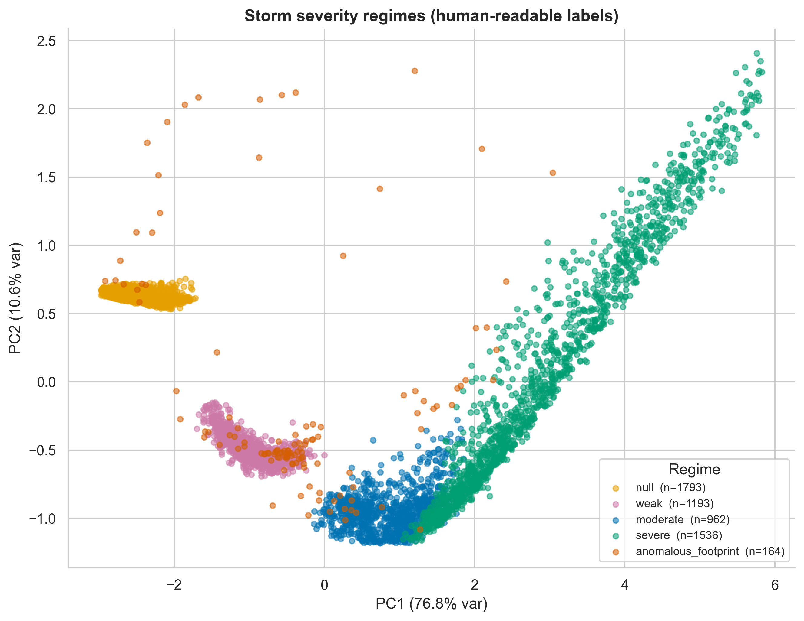
</p>

**Recovering regime membership from background parameters alone.** A small classifier (2 hidden layers, batch norm, dropout) trained on the 7 background parameters predicts regime membership with high accuracy — the confusion matrix below shows most disagreement is between adjacent severity levels (e.g. `weak` vs. `null`), not across the full spectrum.

<p align="center">
  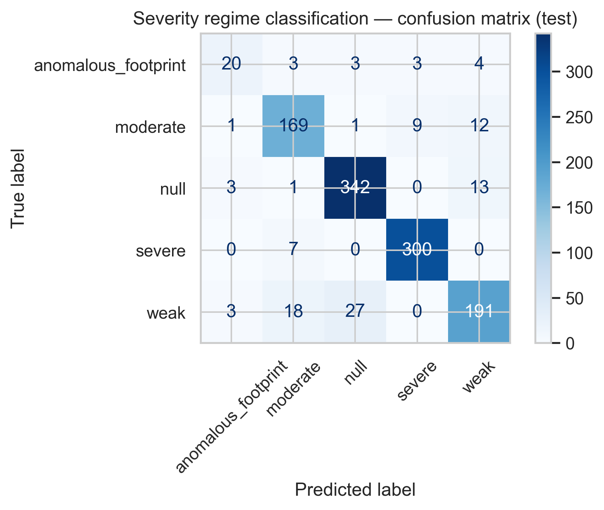
</p>

**Regime membership in background-parameter space.** Plotting regime against `u0` (zonal wind) and `b` (jet height) directly shows why the classifier works: severity increases roughly monotonically with jet strength and height.

<p align="center">
  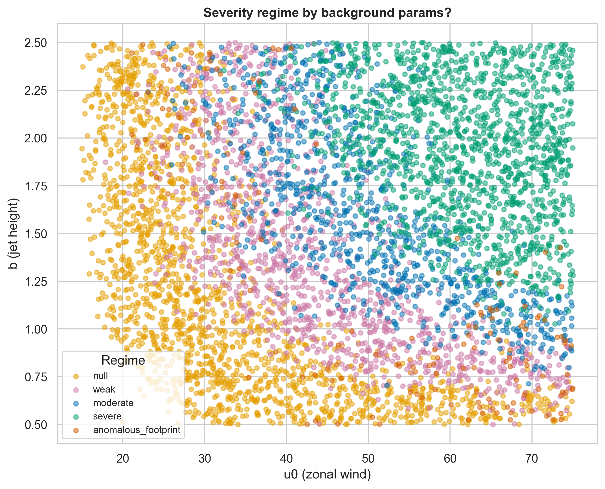
</p>

### 12. Predicting storm severity from background parameters (regression MLP)

A feedforward network (3 hidden layers, batch norm, dropout, early stopping) predicts all 7 continuous severity targets directly from the 7 background parameters.

**All 7 targets.** Core-intensity metrics (MaxVo, MinMSLP, MaxWS10, Vort deepening) are predicted well (R² 0.92–0.97); SSI and both WFP metrics are predicted poorly (R² −0.14 to 0.76), consistent with their zero-inflated, path-dependent nature.

<p align="center">
  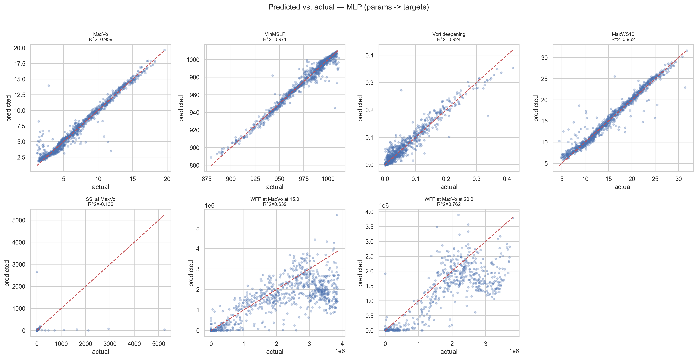
</p>

**Best-performing targets, enlarged.**

<p align="center">
  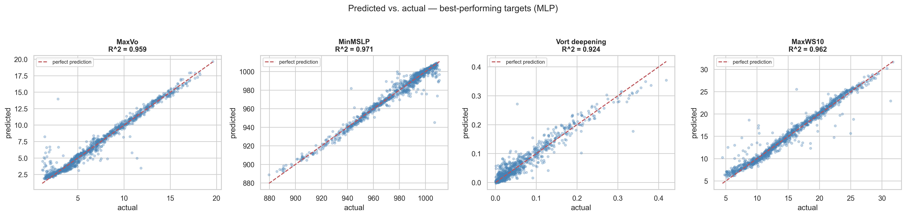
</p>

> **Interpretation.** Core intensity is close to a deterministic function of the initial jet configuration — consistent with linear baroclinic instability theory (e.g. Eady growth rate) — which is why the MLP fits it so cleanly. Impact/footprint severity (SSI, WFP) depends on path-dependent, trajectory-level details (where the storm actually went, not just how energetically it started growing) that the 7 background parameters do not fully constrain. **Storm severity in this system has at least two separable dimensions: a well-determined core-intensity dimension, and a much less-determined impact/footprint dimension.**

### 13. Interactive 3D visualization of severity regimes

Every storm plotted in the space of three background parameters (`u0`, `b`, `Tv0`), colored by severity regime, rotated with the mouse:

<p align="center">
  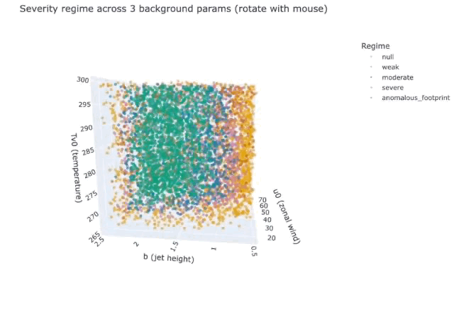
</p>

**[→ Open interactive 3D plot (background params)](figures/16_severity_regimes_3d_interactive.html)**

### 14. Model uncertainty via deep ensembles

A 5-model deep ensemble quantifies prediction confidence for peak vorticity (MaxVo): ensemble mean vs. actual, point size = residual error, point color = ensemble disagreement.

<p align="center">
  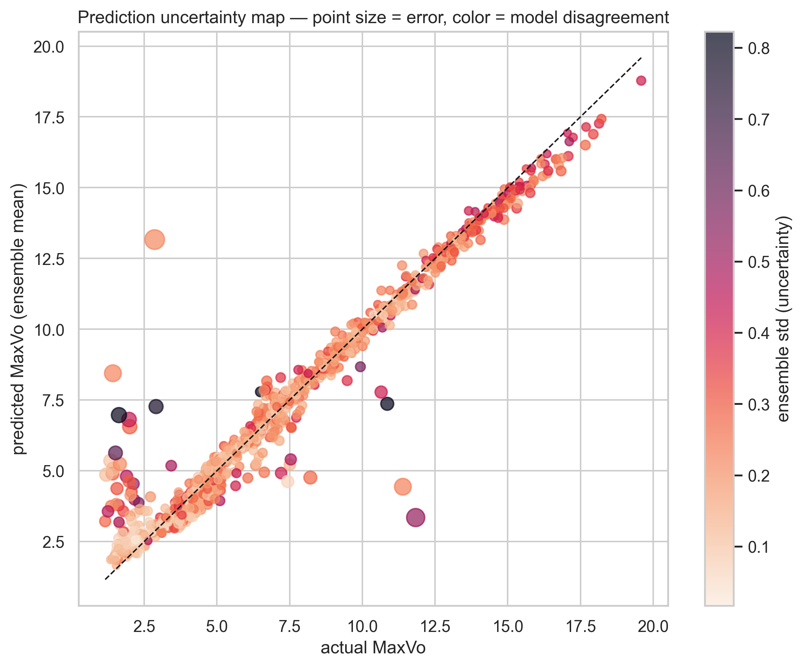
</p>

> **Interpretation.** The model is accurate and confident for strong, clearly-developed storms (small, pale points tight to the diagonal at high MaxVo). Its real weak spot is weak/transitional storms at low MaxVo, where the ensemble disagrees with itself most — likely because these sit closest to the "did a storm even really form" threshold, which is inherently noisier than a clearly-developed severe storm.

### 15. Investigating the anomalous-footprint regime

Distribution of each background parameter within `anomalous_footprint` vs. all other regimes combined.

<p align="center">
  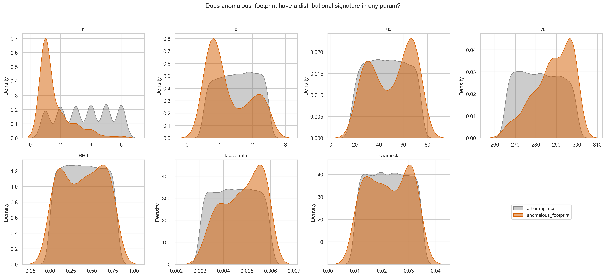
</p>

> **Interpretation.** Six of the seven background parameters show little to no distributional signature. The exception is `Tv0` (initial virtual temperature): `anomalous_footprint` storms concentrate around 285–300K, while the general population spans a much wider range including a lower mode around 265–280K that anomalous storms essentially never touch. This is the first point in the analysis where `Tv0` shows up as meaningfully important — elsewhere it is one of the weakest predictors of core intensity — suggesting temperature matters specifically for the footprint/impact dimension of severity, largely independent of core intensity.

### 16. Severity regimes in full 3D PCA space

PCA refit with 3 components to check how much of the 2D regime separation survives when a third axis of variance is restored:

**[→ Open interactive 3D plot (PCA space)](figures/19_severity_regimes_3d_pca_interactive.html)**

---

## Key findings

- **Storm severity is not unimodal.** A 5-component Gaussian Mixture Model, fit on the full 7-dimensional standardized target space, cleanly separates storms into `null`, `weak`, `moderate`, `severe`, and `anomalous_footprint` regimes — structure stable enough that a simple classifier recovers regime membership from the 7 background parameters alone.
- **Severity has at least two separable dimensions.** PC1 (76.8% of variance) captures *core intensity*; the four metrics that load heavily on it (MaxVo, MinMSLP, MaxWS10, Vort deepening) are all predicted well by the regression MLP (R² 0.92–0.97), consistent with core intensity being close to a deterministic function of the initial jet configuration.
- **Impact/footprint severity (SSI, WFP) is structurally different and much harder to predict.** These targets are zero-inflated (over half of runs never register nonzero SSI) and depend on path-dependent, trajectory-level details the 7 background parameters do not fully constrain.
- **Predictive confidence is regime-dependent, not uniform.** The deep ensemble is accurate and confident for strong storms, but both less accurate and more internally inconsistent for weak/transitional storms near the threshold of whether a storm forms at all.
- **The `anomalous_footprint` regime has one real distinguishing signature: initial virtual temperature (`Tv0`)** — otherwise one of the weakest predictors of core intensity.

Taken together, the strongest single finding is structural rather than numerical: **core intensity is well-determined by the atmospheric state a storm grew out of; impact/footprint is not — at least not from this feature set alone.**

---

## Reproducing this analysis

```bash
git clone https://github.com/shbmmm/baroclinic-storm-severity-regimes.git
cd baroclinic-storm-severity-regimes
python3 -m venv .venv && source .venv/bin/activate
pip install -r requirements.txt
jupyter lab notebooks/baroclinic_storm_severity_regimes.ipynb
```

Point `XML_PATH` and `FEATURES_DIR` (first code cell) at your local copies of the dataset, then run all cells. Every figure is written to `figures/` as the notebook runs — both static PNGs, the `PC_cluster_3D.gif` and `3D_regimes.gif` walkthroughs, and, for the two interactive Plotly views, standalone HTML (plus a static PNG snapshot if the optional `kaleido` package is installed).

---

## Citations

**Dataset**
- Bouvier, C., Cornér, J., Toropainen, A., Bowery, A., Carver, G., Sparrow, S., Wallom, D. & Sinclair, V. A. Baroclinic Wave Simulation Ensemble: a machine learning ready dataset. *Scientific Data* **12**, 1811 (2025). https://doi.org/10.1038/s41597-025-06089-z
- Dataset repository: Bouvier, C. et al. Baroclinic wave simulation ensemble: a machine learning ready dataset. University of Helsinki / FairData.fi (2025). https://doi.org/10.23729/fd-b84c06b2-0950-3bd4-bb98-defc0518eaf5
- Companion code/config: Bouvier, C., van den Broek, D., Ekblom, M. & Sinclair, V. A. bouvierc/Baroclinic lifecycles: OpenIFS initial background states and experiments. Zenodo (2024). https://doi.org/10.5281/zenodo.10592587

**Model**
- ECMWF OpenIFS, cycle 43R3v2 (operational at ECMWF July 2017 – June 2018). ECMWF, *IFS Documentation CY43R3 – Part III: Dynamics and numerical procedures* (2017).
- Bouvier, C., van den Broek, D., Ekblom, M. & Sinclair, V. A. Analytical and adaptable initial conditions for dry and moist baroclinic waves in the global hydrostatic model OpenIFS (CY43R3). *Geoscientific Model Development* **17**, 2961–2986 (2024). https://doi.org/10.5194/gmd-17-2961-2024

**Software**
- Python, NumPy, pandas, Matplotlib, Seaborn, scikit-learn, PyTorch, Plotly (see `requirements.txt` for pinned versions).

**Suggested citation for this repository**
> Shubham, *Baroclinic Storm Severity Regimes in a Perturbed-Physics OpenIFS Ensemble*, 2026. https://github.com/shbmmm/baroclinic-storm-severity-regimes

---

## License

See [LICENSE](LICENSE).
